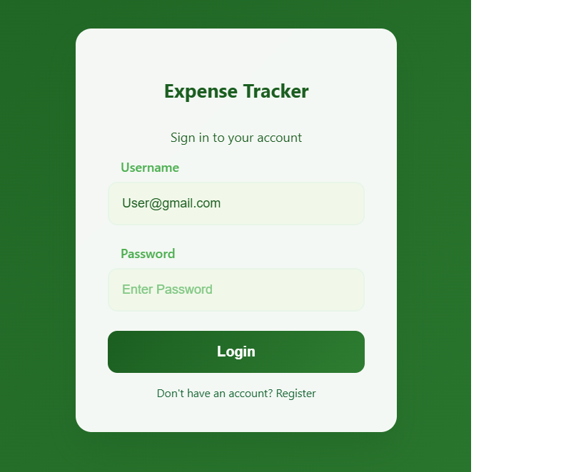
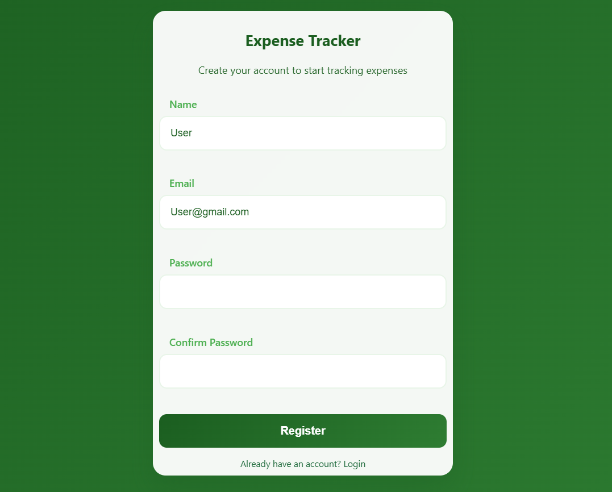
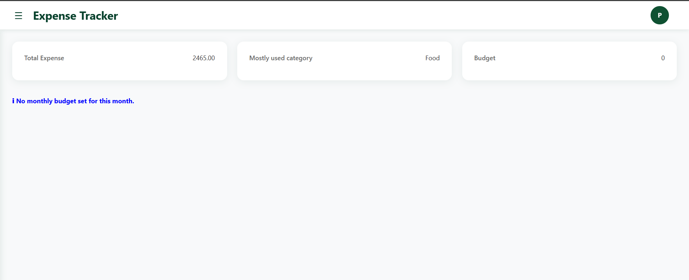
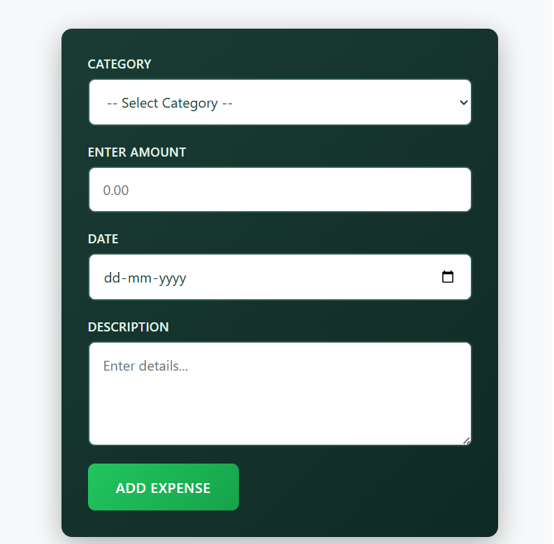
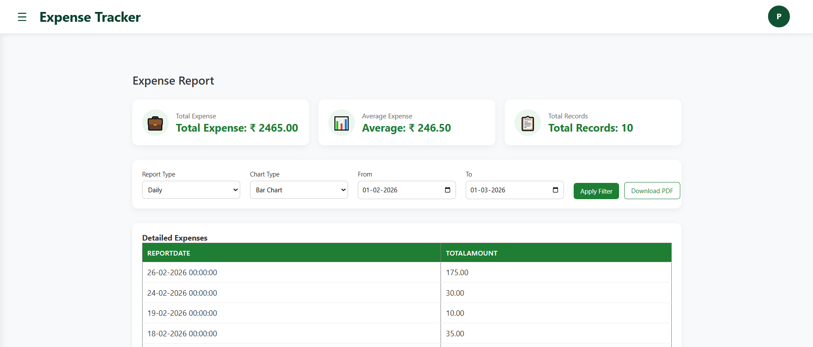

# Expense Tracker 💸

A web-based Expense Tracker built using ASP.NET that helps users track daily expenses, manage budgets, and generate detailed reports.

---

## 🔹 Features
- User Registration & Login system  
- Add, Edit, Delete Expenses  
- Manage Expense Categories  
- Add, Edit, Delete Budget  
- Monthly, Yearly & Category-wise Reports  
- Simple and user-friendly interface  

---

## 🔹 Tech Stack
- ASP.NET Web Forms  
- C#  
- HTML, CSS, JavaScript  
- SQL Server  

---

## 🔑 Demo Admin Login
Email: Admin_88@gmail.com
Password: Admin_8_8  

> Note: This is a demo account for testing purposes only.

---

## 📸 Screenshots

---

## 🚀 How to Run the Project
1. Clone or download the repository  
2. Open `ExpenseTracker.sln` in Visual Studio  
3. Configure SQL Server database  
4. Run the project  

---

## 📌 Future Improvements
- Export reports (Excel)  
- Advanced analytics dashboard  
- Mobile responsiveness  

---

## 🙌 Feedback
Feel free to share your feedback and suggestions!
